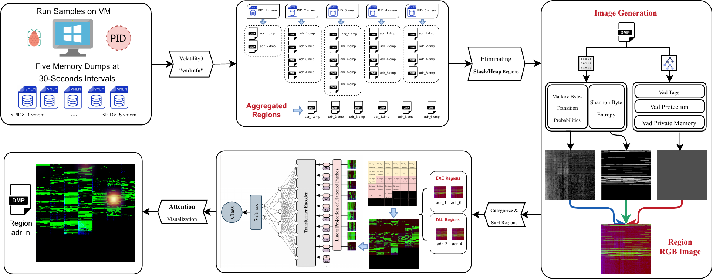
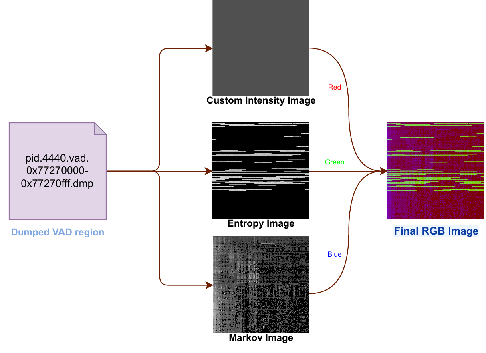
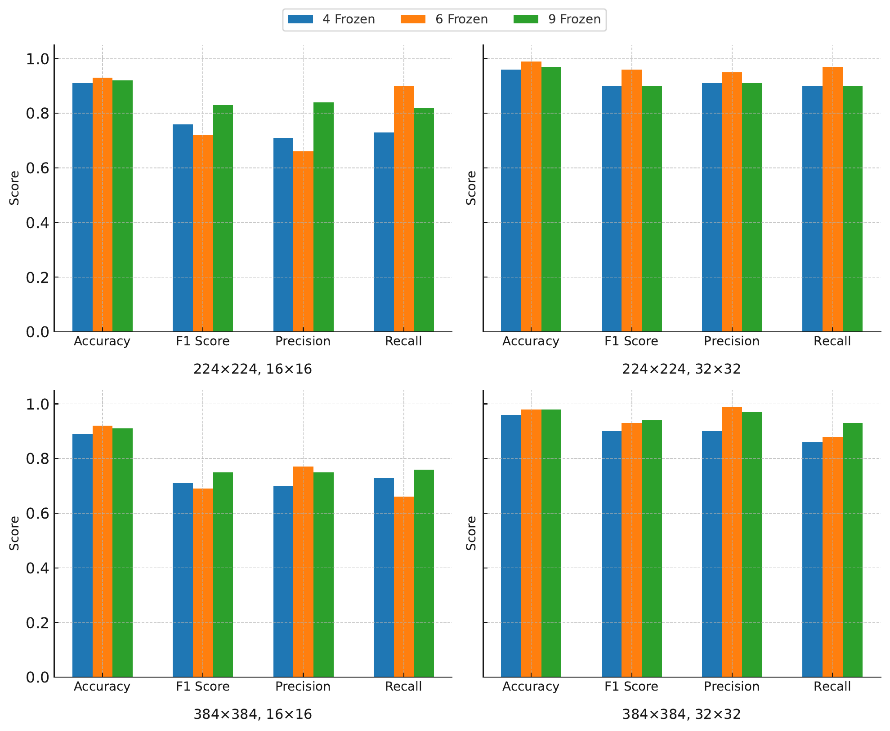
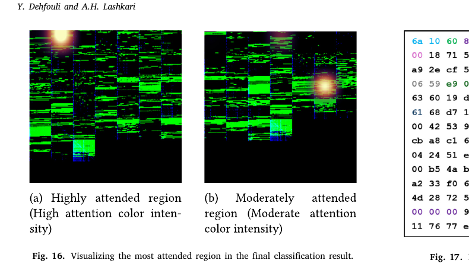
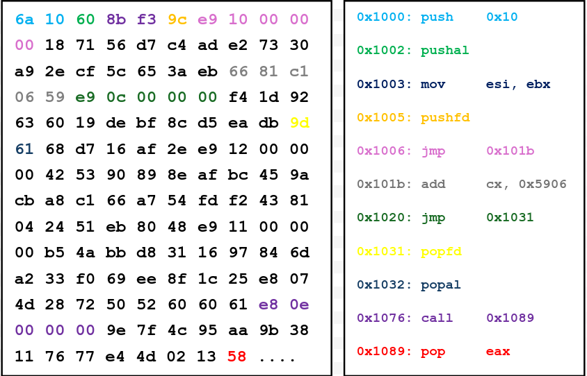

<div align="center">

# VADViT

### Find suspicious process memory, classify the process, and show analysts which memory regions deserve inspection.

VADViT analyzes the **Virtual Address Descriptor (VAD) regions** of a Windows process. It converts each retained region into complementary byte- and memory-structure images, classifies the assembled process image with a Vision Transformer, and maps model attention back to VAD regions for forensic follow-up.

[**Research Report**](https://yacndehfuli.github.io/VADViT/) ·
[**Paper**](https://doi.org/10.1016/j.jisa.2025.104200) ·
[**Method**](https://yacndehfuli.github.io/VADViT/#method) ·
[**Analyst View**](https://yacndehfuli.github.io/VADViT/#analyst) ·
[**Dataset**](https://yacndehfuli.github.io/VADViT/#dataset) ·
[**Reproduce**](#reproducing-the-pipeline) ·
[**Citation**](#citation)

[](LICENSE)
[](https://www.python.org/)
[](https://doi.org/10.1016/j.jisa.2025.104200)
[](https://github.com/YaCnDehfuli/VADViT/releases)

</div>

---

## What this project does

A Windows process does not occupy one continuous block of memory. Its address space is split into **VAD regions**: mapped executables and DLLs, private allocations, stacks, heaps, and other ranges with different permissions and backing.

Those regions contain useful forensic structure, but a full memory dump can contain thousands of them. An analyst still has to decide **which process is suspicious and which memory ranges are worth opening first**.

VADViT turns that problem into a process-level workflow:

| Stage | What happens |
|---|---|
| **Extract** | Volatility 3 dumps the target process's VAD regions from periodic memory snapshots. |
| **Represent** | Each retained region becomes three complementary images: Markov byte transitions, Shannon entropy, and VAD metadata intensity. |
| **Classify** | Region images are ordered into a process-level grid and classified by a Vision Transformer. |
| **Prioritize** | Transformer attention is mapped back to the original VAD regions so analysts can inspect the highest-attention addresses first. |

The published study reports **99.2% binary accuracy** for malicious-vs-benign process classification and **0.92 macro-F1** for nine-class attribution on the best multiclass configuration.

<p align="center">
  
</p>

[**Open the full research report →**](https://yacndehfuli.github.io/VADViT/)

## Why VAD regions?

VADs describe how a process has mapped and allocated memory. Their metadata exposes properties such as virtual address range, file backing, private allocation, and page protection.

That makes them a useful forensic unit for questions such as:

- where executable private memory exists;
- which regions are mapped executables or DLLs;
- where packed or encrypted byte distributions appear;
- how a process's memory layout changes across snapshots; and
- which exact region an analyst should disassemble after a model raises the process for review.

VADViT deliberately works at this region level instead of resizing an entire RAM image into one monolithic picture.

## How one memory region becomes an image

Each retained VAD region is converted into three channels:

- **Markov — blue:** byte-to-byte transition probabilities, preserving sequential structure.
- **Entropy — green:** local Shannon entropy, exposing byte-value diversity associated with packing, encryption, and other high-randomness content.
- **Intensity — red:** VAD semantics derived from region tag, memory protection, and private/shared allocation state.

These are fused into one RGB region image.

<p align="center">
  
</p>

Executable regions are placed first, followed by DLL-backed regions, with virtual-address order preserved inside each category. The resulting grid becomes the Vision Transformer's process representation.

## Published results

The paper evaluates multiple image sizes, patch sizes, and layer-freezing schedules. The strongest binary configuration uses a **224×224 process image, 32×32 patches, six initially frozen ViT blocks, and three gradual unfreezing steps**.

| Task | Published result |
|---|---:|
| Malicious vs benign | **99.2% accuracy** |
| Best binary macro-F1 | **0.96** |
| Nine-class attribution | **92% accuracy** |
| Nine-class macro-F1 | **0.92** |
| Best binary AUC | **0.993** |

The nine classes are **Benign, Backdoor, Exploit, HackTool, Hoax, Rootkit, Trojan, Virus, and Worm**.

<p align="center">
  
</p>

### Why all three image channels matter

The paper includes a controlled two-channel ablation while leaving the rest of the pipeline unchanged:

| Input channels | Accuracy | Macro-F1 |
|---|---:|---:|
| **Full Markov + Entropy + Intensity** | **0.99** | **0.96** |
| Intensity + Entropy | 0.89 | 0.74 |
| Entropy + Markov | 0.88 | 0.73 |
| Markov + Intensity | 0.48 | 0.48 |

The result is useful because the three channels are not cosmetic RGB coloring: removing any one of them materially degrades generalization.

[**See the experiments and ablation in the report →**](https://yacndehfuli.github.io/VADViT/#results)

## Built for analyst follow-up

Classification is only the first output.

Because one ViT patch corresponds to one VAD-region slot, the final attention map can be projected back onto the process grid and then back to the source region filenames and virtual addresses.

<p align="center">
  
</p>

In the paper's qualitative sanity check, the most-attended VAD region from a known HackTool sample contains a recognizable shellcode-style sequence: state-saving instructions, a jump over embedded high-entropy data, and a call-pop pattern used for position-independent access.

<p align="center">
  
</p>

The paper also reports a quantitative attention sanity check: the global high-entropy baseline is **0.18**, while the **top 5 attended regions reach 0.87 entropy precision**. Attention therefore narrows the analyst's search space; it is not presented as a standalone explanation of intent.

[**Read the analyst workflow →**](https://yacndehfuli.github.io/VADViT/#analyst)

## Dataset

The study introduces **BCCC-MalMem-SnapLog-2025**, built from periodic Windows 11 memory captures tied to the executed process PID.

- 2,000 malware samples across eight malware categories
- 250 benign samples from multiple sources
- up to five memory snapshots per sample
- 30-second intervals
- memory, network capture, Sysmon, Security, Application, and system logging
- 2,014 retained samples after excluding timeout cases without extractable VAD regions
- 80/10/10 train/validation/test split in the published experiment

The raw memory collection is not bundled with this repository. The paper's data-availability statement describes the larger multi-source collection as **BCCC-Mal-NetMem-2025**, available to academic researchers on reasonable request under the stated handling/licensing conditions.

## Quick start

A clean checkout does **not** include the raw memory corpus or trained checkpoints. The commands below install the reference implementation and verify its entry points; they do not reproduce the paper's metrics by themselves.

```bash
git clone https://github.com/YaCnDehfuli/VADViT.git
cd VADViT

python3.10 -m venv .venv
source .venv/bin/activate
python -m pip install --upgrade pip
python -m pip install -r requirements.txt

python -c "from models.ViT_model import ViTForImages; from config import MODEL_NAME, MODE, NUM_CLASSES; print(MODEL_NAME, MODE, NUM_CLASSES)"
python test.py --help
python sample_test.py --help
```

Configuration and data paths are documented in [`docs/configuration.md`](docs/configuration.md).

## Reproducing the pipeline

With an authorized dataset and Volatility path configured:

```bash
cd "Data Preprocessing/Dumps_to_Cnosolidated"
python main.py

cd "../Consolidated_to_Grid"
python main.py

cd ../..
python train.py
python test.py
python test.py --explain
```

For a single prepared sample:

```bash
python sample_test.py FAMILY SAMPLE_HASH
```

The explanation path maps the highest-attention process-grid cells back to the executable-region and DLL-region files in address order.

### Reference-implementation note

The published paper specifies **AdamW** with weight decay `1e-2` and a `ReduceLROnPlateau` factor of `0.5`. The current `train.py` uses **Adam** and a scheduler factor of `0.33`.

Those differences should remain explicit. Running the current tree is not, by itself, evidence that the published metric has been reproduced exactly.

## Scope and limitations

VADViT is a **research implementation for postmortem memory forensics**. It is not an EDR, antivirus product, or live endpoint monitor.

Important limits from the paper and repository:

- the extractor currently targets 64-bit Windows memory;
- the target PID must be visible when the snapshot is acquired;
- 30-second capture intervals can miss short-lived injections or memory wipes;
- full memory images and process identity are required, limiting evaluation against feature-only public corpora;
- family attribution is weaker for Trojan-like memory patterns, where shared loaders, packing, encryption, and sparse snapshots create overlap; and
- ViT-Base is practical for a forensic workstation but is still heavy for constrained endpoint devices.

Attention is used to **rank regions for investigation**. A highly attended VAD is a reason to inspect that memory range, not proof that the bytes are malicious or that a specific ATT&CK technique occurred.

## Paper

**Yasin Dehfouli and Arash Habibi Lashkari**, “VADViT: Vision transformer-driven memory forensics for malicious process detection and explainable threat attribution,” *Journal of Information Security and Applications*, vol. 94, 104200, 2025.

[**DOI: 10.1016/j.jisa.2025.104200**](https://doi.org/10.1016/j.jisa.2025.104200)

## Citation

```bibtex
@article{Dehfouli2025VADViT,
  title   = {VADViT: Vision transformer-driven memory forensics for malicious process detection and explainable threat attribution},
  author  = {Dehfouli, Yasin and Lashkari, Arash Habibi},
  journal = {Journal of Information Security and Applications},
  volume  = {94},
  pages   = {104200},
  year    = {2025},
  doi     = {10.1016/j.jisa.2025.104200}
}
```

## Downstream use

[MemTriage](https://github.com/YaCnDehfuli/MemTriage) integrates VADViT as a deep-dive stage after deterministic memory triage. That integration is downstream; VADViT remains independently usable as the published research implementation in this repository.

## License

[MIT](LICENSE).
