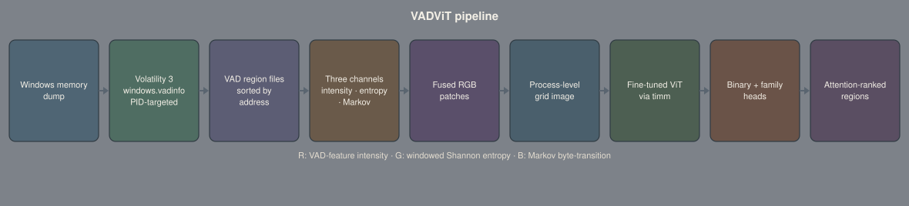
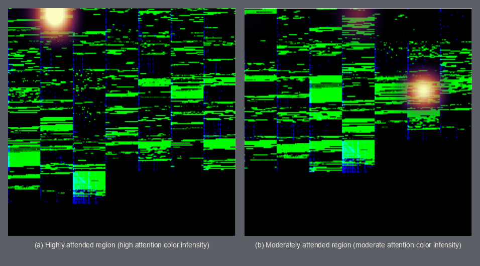

# VADViT

Vision-transformer classification of Windows process memory for malicious-process
detection, with attention-based ranking of the memory regions that drove the verdict.

[](LICENSE)
[](https://www.python.org/)
[](https://doi.org/10.1016/j.jisa.2025.104200)

## Results

Published in the Journal of Information Security and Applications, vol. 94, art. 104200 (2025).

| Task                                   | Metric              | Score |
| -------------------------------------- | ------------------- | ----- |
| Malicious vs. benign process detection | Accuracy            | 99.2% |
| Malware family attribution             | Macro-averaged F1   | 92%   |

Evaluated on BCCC-MalMem-SnapLog-2025. Attention-based ranking orders VAD regions by
their contribution to the verdict, narrowing the region set an analyst reviews by hand.



**Research artifact.** This is the reference implementation for a published paper. It is
not an endpoint agent, a detection product, or a live monitoring tool.

## Quickstart

A clean checkout does not include memory dumps or trained weights. The commands
below create an environment from `requirements.txt` and import the model class.
They do not train or reproduce the published scores.

`requirements.txt` pins `torch==2.0.0` and `timm==0.6.12`. Use CPython 3.10.
CPython 3.11 fails on `import timm` (mutable dataclass default in
`timm.models.maxxvit`). Newer system `python3` builds cannot install these
wheels.

```bash
python3.10 -m venv .venv
source .venv/bin/activate
python -m pip install --upgrade pip
python -m pip install -r requirements.txt
python -c "from models.ViT_model import ViTForImages; from config import MODEL_NAME, MODE, NUM_CLASSES; print(MODEL_NAME, MODE, NUM_CLASSES)"
```

`test.py --help` imports `seaborn` via `utils/test_utils.py`. That package is
not in `requirements.txt`, so the help command fails on a clean install.

## How it works

`Data Preprocessing/Dumps_to_Cnosolidated/region_extractor.py` walks each sample's
`Dumps/` folder. The PID is the prefix of the `.vmem` filename before the first
underscore. For every snapshot still listing that PID, Volatility 3 is invoked as
`windows.vadinfo --pid=<pid> --dump`. `windows.pslist` is used only as a presence
check. Samples with a single dump are flagged `timeout` and skipped.

`region_divider.py` then splits dumped regions into `malware_executable/`, `dlls/`,
and `heap_and_stack/` from the `vadinfo.csv` protection and mapped-file fields.
`dump_selector.py` copies the snapshot that holds the largest combined executable
plus DLL region count into the consolidated tree. Grid construction later uses
only `malware_executable` and `dlls`. Keep the `Dumps_to_Cnosolidated` directory
name as committed.

`Data Preprocessing/Consolidated_to_Grid/process2image.py` turns each retained
`.dmp` into a square RGB patch. Red is a constant VAD-tag plus protection intensity.
Green is windowed Shannon entropy (`ENT_METHOD = DYNAMIC` in the committed
grid config). Blue is a downsampled Markov byte-transition matrix. Patches are
sorted by the `vad.0x...` address in the filename, executable regions first, then
DLL regions, and pasted into a process-level grid. Empty cells are zero-padded.
Overflow is truncated to the grid capacity.

`models/ViT_model.py` loads a pretrained `timm` Vision Transformer named by
`MODEL_NAME` (`vit_base_patch{PATCH_SIZE}_{IMAGE_SIZE}`) and replaces the
classification head. `MODE` in `config.py` selects one head: two classes for
`Binary`, nine for `Multi`. Training in `utils/training_utils.py` freezes the
first `FROZEN_LAYERS` blocks, unfreezes them in `STEPS` later epochs, uses
label-smoothed cross-entropy, temperature-scaled softmax (`T = 0.7`), and
stochastic weight averaging from epoch 32.

`test.py --explain` and `sample_test.py` register a forward hook on the last
attention block, take the class-token row, and overlay it with
`utils/att_visualization.py`. Each grid cell maps back to one VAD region file
so an analyst can open the highest-attention addresses first.


*Published Fig. 16: attention overlaid on a process-level VAD grid. Left: a
strongly attended cell the paper describes as indicative of malicious behavior.
Right: a moderately attended cell. The paper does not name a PID or virtual
address on this figure. Ranked cells are the subset an analyst inspects first.*

## Reproducing the published results

The paper evaluates BCCC-MalMem-SnapLog-2025. Raw dumps and checkpoints are not
in this repository. The paper's data-availability note says the captured dumps
are distributed to academic researchers on request (it names that bundle
BCCC-Mal-NetMem-2025 and states a non-commercial academic licence). Do not
assume a public download.

Committed configs still point at the authors' machines. Edit them before any
run; do not expect the checked-in paths to exist.

- Root `config.py`: `DATASET_PATH = /home/yacn/Datasets/...`,
  `AUC_FOLDER = /home/yacn/AUCs/`, `CM_FOLDER = /home/yacn/CMs/`,
  `SAVE_PATH = ./models/{MODE}_{PATCH_SIZE}_{IMAGE_SIZE}_{FROZEN_LAYERS}f_{STEPS}u.pt`.
  Current values are `MODE = "Multi"`, `IMAGE_SIZE = 224`, `PATCH_SIZE = 32`,
  `FROZEN_LAYERS = 6`, `STEPS = 3`.
- `sample_test.py`: `/media/yacn/My Book Duo/Image_Datasets_family/32_224` and
  `/media/yacn/My Book Duo/BCCC_Consolidated_Dataset`, plus a hard-coded
  HackTool sample hash.
- `Data Preprocessing/Dumps_to_Cnosolidated/config.py`:
  `BASE_DIR`, `OUTPUT_DIR`, `CONSOLIDATED_DIR`, and `VOLATILITY` under
  `/run/media/adam/...` and `/home/adam/...`.
- `Data Preprocessing/Consolidated_to_Grid/config.py`:
  `CONSOLIDATED_DIR` on an external volume and
  `IMAGE_DATASET_DIR = /home/yacn/Image_Datasets`. That file is set to
  `IMAGE_SIZE = 384`, `PATCH_SIZE = 16`, which is not the published best
  binary setting (`32`, `224`, six frozen layers, three unfreeze steps).
- `Data Preprocessing/Dumps_to_Cnosolidated/main.py` skips samples until it
  sees hash `8bc53c486cba7fca5ffe4dd43976cbaac6bfb24acc95d23da5ad5bc0e0689a3e`.
  That resume latch is leftover author-machine state.

After the paths exist:

```bash
cd "Data Preprocessing/Dumps_to_Cnosolidated"
python main.py
cd "../Consolidated_to_Grid"
python main.py
cd ../..
python train.py
python test.py
python test.py --explain
```

Expected artifacts if a run finishes: the checkpoint at `SAVE_PATH`,
`training_plot.png`, and ROC / confusion-matrix PDFs under `AUC_FOLDER` and
`CM_FOLDER`. `sample_test.py` prints class probabilities, shows an overlay, and
lists executable then DLL region filenames in address-sortable order.

The paper's training notes differ from this tree in places that were left as-is:
paper `torch==2.1.0` vs committed `torch==2.0.0`; paper AdamW with weight decay
vs `optim.Adam` in `train.py`; paper `ReduceLROnPlateau` factor `0.5` vs `0.33`
here. `dataset/dataset_loader.py` builds an 80/10/10 split with seed `42`.
`train.py` aborts if those splits share image paths.

## Limitations

- Results are specific to BCCC-MalMem-SnapLog-2025 and its capture methodology.
- VAD extraction runs only for processes that appear in the active process list
  at snapshot time. An analyst still has to try candidate PIDs before the
  matching VAD pattern is found.
- The 30-second snapshot cadence can miss short-lived injections or memory
  wipes. Samples that unmap, encrypt, or repurpose VAD regions between
  snapshots can slip past.
- The method needs a full RAM dump and the live PID so Volatility can rebuild
  the VAD tree. Feature-only sets such as CIC-MalMem and process-only
  collections such as Dumpware10 cannot be used as external test beds.
- Trojan family attribution is weaker than other classes. The paper reports
  lower Trojan recall and treats Trojan as a catch-all when families share
  injection stubs, packers, encryption layers, and high-entropy allocations.
- Sparse single-snapshot captures make Exploit and Backdoor look like Trojan
  loader stubs. The confusion-matrix discussion cites that overlap as a cause
  of those swaps.
- The committed extractor targets 64-bit Windows images. Linux and macOS dumps
  are listed as later work, not as supported inputs.
- ViT-Base training and inference memory is too heavy for many endpoint or IoT
  devices without a discrete GPU. The paper states that quantization or a
  distilled backbone would be required for those cases.

## Citation

Crossref record for `10.1016/j.jisa.2025.104200` (preferred):

```bibtex
@article{Dehfouli2025VADViT,
  title   = {VADViT: Vision transformer-driven memory forensics for malicious process detection and explainable threat attribution},
  author  = {Dehfouli, Yasin and Lashkari, Arash Habibi},
  journal = {Journal of Information Security and Applications},
  volume  = {94},
  pages   = {104200},
  year    = {2025},
  month   = nov,
  doi     = {10.1016/j.jisa.2025.104200}
}
```

`CITATION.cff` stores the second author as family name `Habibi Lashkari` and
given name `Arash`, and omits the article number / pages field. The published
DOI record above is the one to copy.

## Related work in this portfolio

- [VolMemLyzer3](https://github.com/YaCnDehfuli/VolMemLyzer3-CLI_forensic_tool) — the extraction layer
- [MemTriage](https://github.com/YaCnDehfuli/MemTriage) — the analyst workspace that consumes this model
